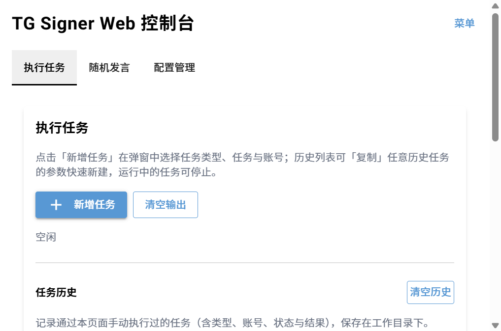
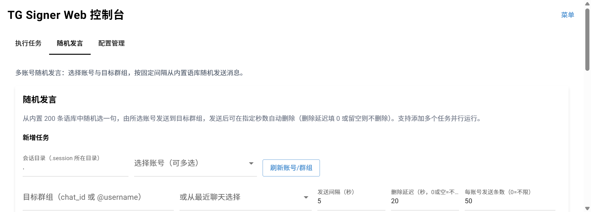

## Telegram每日自动签到/个人、群组、频道消息监控与自动回复

[English](./README_EN.md)

> 本项目为 [amchii/tg-signer](https://github.com/amchii/tg-signer) 的 fork，发布为 PyPI 包 `tg-signer-plus`，命令行入口为 `tg-signer-plus`，并新增 WebUI 随机发言等功能。

### WebUI 用户指南（新增功能）

安装并启动 WebUI：

```sh
pip install "tg-signer-plus[gui]"
tg-signer-plus webgui  # 启动后访问 http://127.0.0.1:8080
```

页面包含「执行任务 / 随机发言 / 配置管理」三个标签页（刷新后自动回到上次选中的标签），右上角「菜单」按钮内有：工作目录 / 用户信息 / 签到记录 / 日志。

#### 执行任务



- 选择任务类型（签到 / 定时 / 监控 / 自动化）与配置，勾选要执行的账号，点击「执行任务」
- 输出区实时显示执行日志，可随时「停止」或「清空输出」
- 「任务历史」记录最近的执行，点击行内「复制」会用该次参数回填新增任务弹窗，方便再次执行

#### 随机发言



- 「新增任务」表单：选择账号（可多选）、目标群组（手动输入 chat_id / @username，或从最近聊天下拉选择，仅显示群组）、发送间隔、删除延迟、每账号发送条数
- 点击「添加任务」创建并自动启动，支持多个任务并行运行
- 每个账号独立计时：实际间隔 = 设定秒数 + 随机 0~3 秒，从内置 200 条语料库随机选句发送到目标群组
- 删除延迟填 0 或留空则消息不删除；否则发送 N 秒后自动撤回，停止任务后剩余消息仍按延迟依次撤回
- 每个任务支持「启动 / 停止 / 复制 / 删除」；任务配置持久化到 `.signer/random_chat_tasks.json`，刷新页面或重启服务后自动恢复
- 底部共用日志区展示所有任务日志，每行带 `[#任务编号]` 前缀，发送与撤回记录显示群聊名称

### 功能

- 每日定时和随机误差时间签到
- 根据配置的文本点击键盘
- 调用AI进行图片识别并点击键盘
- 个人、群组、频道消息监控、转发与自动回复
- 根据配置执行动作流
- 自动化规则引擎（message/timer/startup 触发 + handler 链）
- WebUI 随机发言（tg-signer-plus 新增）：多账号多任务并行、内置 200 条语料随机发送、每账号独立计时、可选定时自动撤回

  **...**

### 安装

需要Python3.10及以上

```sh
pip install -U tg-signer-plus
```

或者为了提升程序速度：

```sh
pip install "tg-signer-plus[speedup]"
```

启用 YAML 配置支持：

```sh
pip install "tg-signer-plus[yaml]"
```
#### WebUI
tg-signer-plus附带了一个WebUI，安装命令:
```sh
pip install "tg-signer-plus[gui]"
```


> WebUI 使用说明见文档开头「WebUI 用户指南」章节。


### Docker

#### GitHub Container Registry
在 GitHub Container Registry 提供了两种预构建镜像：`ghcr.io/amchii/tg-signer:<tag>`（CLI）和 `ghcr.io/amchii/tg-signer:<tag>-webui`（CLI + WebUI）。注意这些为上游镜像，本 fork（tg-signer-plus）未单独发布镜像，建议直接 `pip install tg-signer-plus` 使用。

#### 本地
如果需要自行构建镜像，本地 build 方式仍然保留，见 [docker](./docker) 目录下的 Dockerfile 和 [README](./docker/README.md) 。

### 使用方法

```
Usage: tg-signer-plus [OPTIONS] COMMAND [ARGS]...

  使用<子命令> --help查看使用说明

子命令别名:
  run_once -> run-once
  send_text -> send-text

Options:
  -l, --log-level [debug|info|warn|error]
                                  日志等级, `debug`, `info`, `warn`, `error`
                                  [default: info]
  --log-file PATH                 日志文件路径, 可以是相对路径  [default: logs/tg-
                                  signer.log]
  --log-dir PATH                  日志文件目录, 可以是相对路径  [default: logs]
  -p, --proxy TEXT                代理地址, 例如: socks5://127.0.0.1:1080,
                                  会覆盖环境变量`TG_PROXY`的值  [env var: TG_PROXY]
  --session_dir PATH              存储TG Sessions的目录, 可以是相对路径  [default: .]
  -a, --account TEXT              自定义账号名称，对应session文件名为<account>.session  [env
                                  var: TG_ACCOUNT; default: my_account]
  -w, --workdir PATH              tg-signer工作目录，用于存储配置和签到记录等  [default:
                                  .signer]
  --session-string TEXT           Telegram Session String,
                                  会覆盖环境变量`TG_SESSION_STRING`的值  [env var:
                                  TG_SESSION_STRING]
  --in-memory                     是否将session存储在内存中，默认为False，存储在文件
  --help                          Show this message and exit.

Commands:
  export                  导出配置，默认为输出到终端。
  import                  导入配置，默认为从终端读取。
  list                    列出已有配置
  list-members            查询聊天（群或频道）的成员, 频道需要管理员权限
  list-folders            列出 Telegram 普通对话 Folder
  list-sign-records       列出最近N条签到记录
  list-topics             列出群组话题ID（message_thread_id）
  list-schedule-messages  显示已配置的定时消息
  llm-config              配置大模型API
  login                   登录账号（用于获取session）
  migrate-sign-records    将签到记录从 JSON 迁移到 SQLite（默认保留原...
  logout                  登出账号并删除session文件
  automation              配置和运行自动化规则（推荐，覆盖monitor能力）
  monitor                 配置和运行监控
  multi-run               使用一套配置同时运行多个账号
  reconfig                重新配置
  run                     根据任务配置运行签到
  run-once                运行一次签到任务，即使该签到任务今日已执行过
  schedule-messages       批量配置Telegram自带的定时发送消息功能
  send-dice               发送一次DICE消息, 请确保当前会话已经"见过"该`chat_id`。...
  send-text               发送一次文本消息, 请确保当前会话已经"见过"该`chat_id`
  version                 Show version
  webgui                  启动一个WebGUI（需要通过`pip install "tg-signer[gui]"`安装相关依赖）

```

例如:

```sh
tg-signer-plus run
tg-signer-plus run my_sign  # 不询问，直接运行'my_sign'任务
tg-signer-plus run-once my_sign  # 直接运行一次'my_sign'任务
tg-signer-plus list-folders  # 列出 Telegram 普通 Folder 的 ID、名称和显式对话数量
tg-signer-plus login --from-folder Sign  # 登录账号并从 Sign Folder 发现对话
tg-signer-plus run --from-folder Sign my_sign  # 从 Sign Folder 发现对话后运行任务
tg-signer-plus list-sign-records linuxdo -n 5  # 查看任务 linuxdo 最近 5 条签到记录
tg-signer-plus migrate-sign-records  # 将.signer/signs 下的签到记录迁移到 SQLite
tg-signer-plus send-text 8671234001 /test  # 向chat_id为'8671234001'的聊天发送'/test'文本
tg-signer-plus send-text @neo /test  # 向username为'@neo'的聊天发送'/test'文本
tg-signer-plus send-text --message-thread-id 1 -- -1003763902761 checkin  # 发送到群组话题(message_thread_id=1)
tg-signer-plus send-text -- -10006758812 浇水  # 对于负数需要使用POSIX风格，在短横线'-'前方加上'--'
tg-signer-plus send-text --delete-after 1 8671234001 /test  # 向chat_id为'8671234001'的聊天发送'/test'文本, 并在1秒后删除发送的消息
tg-signer-plus list-members --chat_id -1001680975844 --admin  # 列出频道的管理员
tg-signer-plus list-topics --chat_id -1003763902761 --limit 50  # 列出群组话题及message_thread_id
tg-signer-plus schedule-messages --crontab '0 0 * * *' --next-times 10 -- -1001680975844 你好  # 在未来10天的每天0点向'-1001680975844'发送消息
tg-signer-plus schedule-messages --crontab '0 0 * * *' --next-times 3 --message-thread-id 1 -- -1003763902761 你好  # 配置群组话题的定时消息
tg-signer-plus automation init my_auto  # 初始化自动化模板
tg-signer-plus automation run my_auto  # 运行自动化任务
tg-signer-plus monitor run  # 配置个人、群组、频道消息监控与自动回复
tg-signer-plus multi-run -a account_a -a account_b same_task  # 使用'same_task'的配置同时运行'account_a'和'account_b'两个账号
tg-signer-plus webgui --auth-code averycomplexcode  # 启动一个WebGUI
```

### 自动化规则（automation）

推荐使用 `tg-signer-plus automation` 统一管理自动化规则（覆盖 monitor 能力）。

```sh
tg-signer-plus automation init my_auto
# 编辑 .signer/automations/my_auto/config.json
tg-signer-plus automation run my_auto
```

更多详细使用说明与示例见：`docs/automation_usage.md`

### 配置代理（如有需要）

`tg-signer-plus`不读取系统代理，可以使用环境变量 `TG_PROXY`或命令参数`--proxy`进行配置

例如：

```sh
export TG_PROXY=socks5://127.0.0.1:7890
```

### 登录

```sh
tg-signer-plus login
```

根据提示输入手机号码和验证码进行登录并获取最近的聊天列表，确保你想要签到的聊天在列表内。
签到任务里的`chat_id`同时支持整数ID和以`@`开头的username，例如`@neo`。
对于论坛群组，登录输出中会额外打印每个话题的 `message_thread_id`，可直接用于 `--message-thread-id`。

如果目标对话不在最近列表中，可以在 Telegram 新建一个普通 Folder，手动把目标对话加入其中，然后按名称或 ID 加载：

```sh
tg-signer-plus list-folders
tg-signer-plus login --from-folder Sign
# 名称重复时使用 ID
tg-signer-plus login --from-folder 2
```

`--from-folder` 表示“从 Folder 发现对话”，也适用于 `run`、`run-once`、`multi-run`、`automation run` 和 `monitor run`。指定后会加载 Folder 中所有手动加入或置顶的对话，`--num-of-dialogs` 不再生效。当前不支持按联系人、非联系人、机器人、群组或频道等动态规则生成成员的 Folder；请使用只包含手动添加对话的普通 Folder。

### 时区

调度相关命令（如 `run` 和 `schedule-messages`）会按以下顺序解析时区：

1. 环境变量 `TZ`
2. Python 识别到的本地时区
3. 默认回退到 `Asia/Shanghai`

如果你需要按特定时区计算下次执行时间，直接在运行前设置 `TZ` 即可。

### 获取群组话题 ID

```sh
tg-signer-plus list-topics --chat_id -1003763902761
```

会输出该论坛群组可见话题的 `message_thread_id`、标题及状态，便于配置签到到指定话题。

### 发送一次消息

```sh
tg-signer-plus send-text 8671234001 hello  # 向chat_id为'8671234001'的聊天发送'hello'文本
tg-signer-plus send-text @neo hello  # 向username为'@neo'的聊天发送'hello'文本
```

### 运行签到任务

```sh
tg-signer-plus run
```

或预先执行任务名：

```sh
tg-signer-plus run linuxdo
```

根据提示进行配置即可。

#### 示例：

```
开始配置任务<linuxdo>
第1个签到
一. Chat ID（登录时最近对话输出中的ID或@username）: 7661096533
二. Chat名称（可选）: jerry bot
三. 是否发送到话题（message_thread_id）？(y/N)：y
四. message_thread_id: 1
五. 开始配置<动作>，请按照实际签到顺序配置。
  1: 发送普通文本
  2: 发送Dice类型的emoji
  3: 根据文本点击键盘
  4: 根据图片选择选项
  5: 回复计算题

第1个动作:
1. 输入对应的数字选择动作: 1
2. 输入要发送的文本: checkin
3. 是否继续添加动作？(y/N)：y
第2个动作:
1. 输入对应的数字选择动作: 3
2. 键盘中需要点击的按钮文本: 签到
3. 是否继续添加动作？(y/N)：y
第3个动作:
1. 输入对应的数字选择动作: 4
图片识别将使用大模型回答，请确保大模型支持图片识别。
2. 是否继续添加动作？(y/N)：y
第4个动作:
1. 输入对应的数字选择动作: 5
计算题将使用大模型回答。
2. 是否继续添加动作？(y/N)：y
第5个动作:
1. 输入对应的数字选择动作: 2
2. 输入要发送的骰子（如 🎲, 🎯）: 🎲
3. 是否继续添加动作？(y/N)：n
在运行前请通过环境变量正确设置`OPENAI_API_KEY`, `OPENAI_BASE_URL`。默认模型为"gpt-4o", 可通过环境变量`OPENAI_MODEL`更改。
六. 等待N秒后删除签到消息（发送消息后等待进行删除, '0'表示立即删除, 不需要删除直接回车）, N: 10
╔════════════════════════════════════════════════╗
║ Chat ID: 7661096533                            ║
║ Name: jerry bot                                ║
║ Message Thread ID: 1                           ║
║ Delete After: 10                               ║
╟────────────────────────────────────────────────╢
║ Actions Flow:                                  ║
║ 1. [发送普通文本] Text: checkin                ║
║ 2. [根据文本点击键盘] Click: 签到              ║
║ 3. [根据图片选择选项]                          ║
║ 4. [回复计算题]                                ║
║ 5. [发送Dice类型的emoji] Dice: 🎲              ║
╚════════════════════════════════════════════════╝
第1个签到配置成功

继续配置签到？(y/N)：n
每日签到时间（time或crontab表达式，如'06:00:00'或'0 6 * * *'）:
签到时间误差随机秒数（默认为0）: 300
```

### 配置与运行监控
说明：monitor 为 legacy 功能，推荐使用 `tg-signer-plus automation` 统一管理自动化规则。

```sh
tg-signer-plus monitor run my_monitor
```

根据提示进行配置。

#### 示例：

```
开始配置任务<my_monitor>
聊天chat id和用户user id均同时支持整数id和字符串username, username必须以@开头，如@neo

配置第1个监控项
1. Chat ID（登录时最近对话输出中的ID）: -4573702599
2. 匹配规则('exact', 'contains', 'regex', 'all'): contains
3. 规则值（不可为空）: kfc
4. 只匹配来自特定用户ID的消息（多个用逗号隔开, 匹配所有用户直接回车）: @neo
5. 默认发送文本: V Me 50
6. 从消息中提取发送文本的正则表达式:
7. 等待N秒后删除签到消息（发送消息后等待进行删除, '0'表示立即删除, 不需要删除直接回车）, N:
继续配置？(y/N)：y

配置第2个监控项
1. Chat ID（登录时最近对话输出中的ID）: -4573702599
2. 匹配规则('exact', 'contains', 'regex'): regex
3. 规则值（不可为空）: 参与关键词：「.*?」
4. 只匹配来自特定用户ID的消息（多个用逗号隔开, 匹配所有用户直接回车）: 61244351
5. 默认发送文本:
6. 从消息中提取发送文本的正则表达式: 参与关键词：「(?P<keyword>(.*?))」\n
7. 发送文本模板（可用{extracted}/{group1}/命名分组；不需要则直接回车）: 我要参与 {keyword}
8. 等待N秒后删除签到消息（发送消息后等待进行删除, '0'表示立即删除, 不需要删除直接回车）, N: 5
继续配置？(y/N)：y

配置第3个监控项
1. Chat ID（登录时最近对话输出中的ID）: -4573702599
2. 匹配规则(exact, contains, regex, all): all
3. 只匹配来自特定用户ID的消息（多个用逗号隔开, 匹配所有用户直接回车）:
4. 总是忽略自己发送的消息（y/N）: y
5. 默认发送文本（不需要则回车）:
6. 是否使用AI进行回复(y/N): n
7. 从消息中提取发送文本的正则表达式（不需要则直接回车）:
8. 是否通过Server酱推送消息(y/N): n
9. 是否需要转发到外部（UDP, Http）(y/N): y
10. 是否需要转发到UDP(y/N): y
11. 请输入UDP服务器地址和端口（形如`127.0.0.1:1234`）: 127.0.0.1:9999
12. 是否需要转发到Http(y/N): y
13. 请输入Http地址（形如`http://127.0.0.1:1234`）: http://127.0.0.1:8000/tg/user1/messages
继续配置？(y/N)：n

```

#### 示例解释：

1. 聊天`chat id`和用户`user id`均同时支持整数**id**和字符串**username**, username**必须以@开头** 如"neo"输入"@neo"，注意*
   *username** 可能不存在，示例中`chat id`为-4573702599表示规则只对-4573702599对应的聊天有效。

2. 匹配规则，目前皆**忽略大小写**：

    1. `exact` 为精确匹配，消息必须精确等于该值。

    2. `contains` 为包含匹配，如contains="kfc"，那么只要收到的消息中包含"kfc"如"I like MacDonalds rather than KfC"
       即匹配到（注意忽略了大小写）

    3. `regex` 为正则，参考  [Python正则表达式](https://docs.python.org/zh-cn/3/library/re.html) ，在消息中有**搜索到该正则即匹配
       **，示例中的 "参与关键词：「.*?」" 可以匹配消息： "新的抽奖已经创建...
       参与关键词：「我要抽奖」

       建议先私聊机器人"

    4. 可以只匹配来自特定用户的消息，如群管理员而不是随便什么人发布的抽奖消息

    5. 可以设置默认发布文本， 即只要匹配到消息即默认发送该文本

    6. 提取发布文本的正则，例如 "参与关键词：「(?P<keyword>.*?)」\n" ，注意用括号`(...)` 捕获要提取的文本，
       可以捕获第3点示例消息的关键词"我要抽奖"并自动发送。若配置了发送文本模板，可用 `{extracted}` 或
       `{group1}` 引用第一个捕获组，也可用 `{keyword}` 引用命名分组，例如模板 `我要参与 {keyword}` 会发送
       `我要参与 我要抽奖`。

3. 消息Message结构参考:

```json
{
    "_": "Message",
    "id": 2950,
    "from_user": {
        "_": "User",
        "id": 123456789,
        "is_self": false,
        "is_contact": false,
        "is_mutual_contact": false,
        "is_deleted": false,
        "is_bot": false,
        "is_verified": false,
        "is_restricted": false,
        "is_scam": false,
        "is_fake": false,
        "is_support": false,
        "is_premium": false,
        "is_contact_require_premium": false,
        "is_close_friend": false,
        "is_stories_hidden": false,
        "is_stories_unavailable": true,
        "is_business_bot": false,
        "first_name": "linux",
        "status": "UserStatus.ONLINE",
        "next_offline_date": "2025-05-30 11:52:40",
        "username": "linuxdo",
        "dc_id": 5,
        "phone_number": "*********",
        "photo": {
            "_": "ChatPhoto",
            "small_file_id": "AQADBQADqqcxG6hqrTMAEAIAA6hqrTMABLkwVDcqzBjAAAQeBA",
            "small_photo_unique_id": "AgADqqcxG6hqrTM",
            "big_file_id": "AQADBQADqqcxG6hqrTMAEAMAA6hqrTMABLkwVDcqzBjAAAQeBA",
            "big_photo_unique_id": "AgADqqcxG6hqrTM",
            "has_animation": false,
            "is_personal": false
        },
        "added_to_attachment_menu": false,
        "inline_need_location": false,
        "can_be_edited": false,
        "can_be_added_to_attachment_menu": false,
        "can_join_groups": false,
        "can_read_all_group_messages": false,
        "has_main_web_app": false
    },
    "date": "2025-05-30 11:47:46",
    "chat": {
        "_": "Chat",
        "id": -52737131599,
        "type": "ChatType.GROUP",
        "is_creator": true,
        "is_deactivated": false,
        "is_call_active": false,
        "is_call_not_empty": false,
        "title": "测试组",
        "has_protected_content": false,
        "members_count": 4,
        "permissions": {
            "_": "ChatPermissions",
            "can_send_messages": true,
            "can_send_media_messages": true,
            "can_send_other_messages": true,
            "can_send_polls": true,
            "can_add_web_page_previews": true,
            "can_change_info": true,
            "can_invite_users": true,
            "can_pin_messages": true,
            "can_manage_topics": true
        }
    },
    "from_offline": false,
    "show_caption_above_media": false,
    "mentioned": false,
    "scheduled": false,
    "from_scheduled": false,
    "edit_hidden": false,
    "has_protected_content": false,
    "text": "test, 测试",
    "video_processing_pending": false,
    "outgoing": false
}
```

#### 示例运行输出：

```
[INFO] [tg-signer] 2024-10-25 12:29:06,516 core.py 458 开始监控...
[INFO] [tg-signer] 2024-10-25 12:29:37,034 core.py 439 匹配到监控项：MatchConfig(chat_id=-4573702599, rule=contains, rule_value=kfc), default_send_text=V me 50, send_text_search_regex=None
[INFO] [tg-signer] 2024-10-25 12:29:37,035 core.py 442 发送文本：V me 50
[INFO] [tg-signer] 2024-10-25 12:30:02,726 core.py 439 匹配到监控项：MatchConfig(chat_id=-4573702599, rule=regex, rule_value=参与关键词：「.*?」), default_send_text=None, send_text_search_regex=参与关键词：「(?P<keyword>(.*?))」\n
[INFO] [tg-signer] 2024-10-25 12:30:02,727 core.py 442 发送文本：我要抽奖
[INFO] [tg-signer] 2024-10-25 12:30:03,001 core.py 226 Message「我要抽奖」 to -4573702599 will be deleted after 5 seconds.
[INFO] [tg-signer] 2024-10-25 12:30:03,001 core.py 229 Waiting...
[INFO] [tg-signer] 2024-10-25 12:30:08,260 core.py 232 Message「我要抽奖」 to -4573702599 deleted!
```

### 版本变动日志

版本变动日志已移至 [CHANGELOG.md](CHANGELOG.md#版本变动日志)。

### 配置与数据存储位置

数据和配置默认保存在 `.signer` 目录中。然后运行 `tree .signer`，你将看到：

```
.signer
├── .openai_config.json  # 可选，大模型配置
├── data.sqlite3  # SQLite 签到记录库
├── monitors  # 监控
│   ├── my_monitor  # 监控任务名
│       └── config.json  # 监控配置
├── users
│   └── 123456789
│       ├── latest_chats.json  # 获取的最近对话
│       └── me.json  # 个人信息
├── automations  # 自动化规则
│   ├── my_auto  # 自动化任务名
│       ├── config.json  # 自动化配置
│       └── state.json  # 运行状态
└── signs  # 签到任务
    └── linuxdo  # 签到任务名
        ├── config.json  # 签到配置
        ├── 123456789
        │   └── sign_record.json  # 旧版 JSON 签到记录（兼容迁移）
        └── sign_record.json  # 更旧版 JSON 路径（兼容迁移）

```

迁移到 SQLite 后，新的签到记录只写入 `data.sqlite3`，但仍兼容读取旧
`sign_record.json`。当运行任务时如果检测到旧 JSON，程序会输出提示并尝试将该任务
的历史记录自动导入 SQLite。
